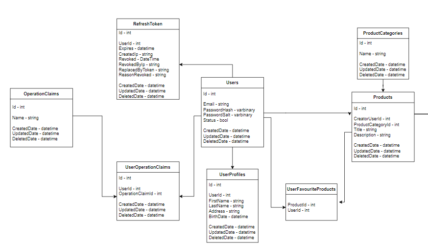
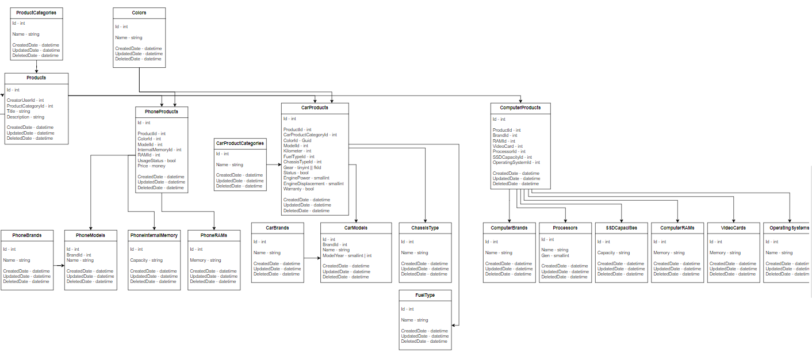
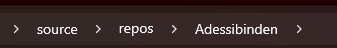
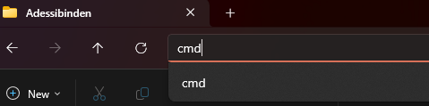

# adessibinden Backend Project
>Bu proje Young Adessi Emre Duman tarafından oluşturulmuştur.
---

## Proje Amacı

Son nesil, güncel ve en iyi çözümleri kullanmaya çalışıp, birden çok pattern ve çözümlerin içerdiği örnek bir proje oluşturmaya çalışmaktayım. 
Projenin içeriği bir e-ticaret sitesi back-end'i. Proje hala gelişmekte olup Open-Source olarak devam etmektedir. Contribution etiketinden nasıl
destekte bulunabileceğinize ulaşabilirsiniz.

## İçerik
1. [Kullanılan Teknolojiler](#kullanılan-teknolojiler)
2. [Veri Tabanı Tasarımı](#veri-tabanı-tasarımı)
3. [Projeyi Ayağa Kaldırmak](#projeyi-ayağa-kaldırmak)
    - [Developer ortamı](#developer-ortamı)
    - [Kullanıcı ortamı (docker-compose)](#kullanıcı-ortamı)
4. [Destek](#destek)
5. [Lisans](#lisans)

---
## Kullanılan Teknolojiler
- .Net 8
- Entity Framework
- Mediatr
- CQRS
- JWT Authentication, Authorization
- AutoMapper
- Code-First ve DB-First
- PostgreSQL
- Domain Driven Design
- Clean Architecture
- Docker, Docker Compose
- Repository Pattern, Factory Pattern, Decorator Pattern, ...

---
## Veri Tabanı Tasarımı

## Projeyi Ayağa Kaldırmak
    
Gereksinimler:
- .Net 8

### Developer Ortamı

1. Developer ortamında çalışmalarınızı yürütmek için öncelikle repoyu   `git clone https://github.com/Emopusta/adessibinden.git`   yardımı ile çalışma ortamınıza klonlamanız gerekmektedir.
2. WebAPI katmanını startup proje olarak belirleyiniz.
3. `appsettings.json` içerisinde ConnectionString'de hostunuzu `localhost` veya tercihiniz hangi yönde ise onu yapınız.
4. Gerekli postgre konfigurasyonlarını yapınız.
5. Package Manager Console yardımıyla `update-database` komutu ile veri tabanınızı oluşturunuz.
6. Ardından projeyi çalıştırınız.

### Kullanıcı Ortamı

1. Kullanıcı ortamında çalışmalarınız yürütmek için öncelikle repoyu   `git clone https://github.com/Emopusta/adessibinden.git`   yardımı ile çalışma ortamınıza klonlamanız gerekmektedir.
2. WebAPI içerisindeki `appsettings.json` içerisinde sadece postgre kullanıcı adı ve şifresini giriniz.
3. `docker.compose.yml` dosyası içerisinden postgre kısmına aynı kullanıcı adı ve şifreyi giriniz.
4. [Front-end](https://github.com/Emopusta/adessibinden-blazor) `git clone https://github.com/Emopusta/adessibinden-blazor.git` projesini bu proje ile aynı dizine klonlayınız 
    |- repos  
    |---|- KlonlananProje  
    |---|---| Adessibinden  
    |---|---| AdessibindenFrontend
5. CMD (Komut İstemi) ni açınız ve projenin `docker.compose.yml` dosyasının bulunduğu dizinine gidiniz. [Dizine nasıl gidilir?](#dizine-nasıl-gidilir)
6. `docker compose build` komutunu çalıştırınız (Windowsta Docker Desktop çalışıyor iken yapmanız gerekli.)
7. Build işlemi tamamlandıktan sonra `docker compose up` yaparak sistemi ayağa kaldırınız.
8. `http://localhost:8080/` adresinden projeye erişebilirsiniz.

### Dizine nasıl gidilir?

**1. Yöntem:** `Windows + R` içine `cmd` yazarak veya arama yerine `cmd` veya `komut istemi` yazarak komut istemini açınız. ardından `cd` komutu ile gitmek istediğiniz yere doğru yöneliniz. ör: `cd source\repos\Adessibinden`

**2. Yöntem:** Dosya Gezgini yardımıyla dosya konumuna gidiniz ardından dosya yolunun kısmına `cmd` yazınız ve enter'a basınız. 
 Ör: 

 

## Destek

1. Projeyi forklayınız.
2. [Developer Ortamı](#developer-ortamı) Kurulumlarını yapınız.
3. Yeni bir branch açarak yapmak istediğiniz değişiklikleri ekleyiniz.
4. Gerekli yorum ve anlatımlar ile Pull-Request açınız.

## Lisans

MIT Lisansı geçerlidir. `LICENSE` kısmından detaylı bilgiyi edinebilirsiniz.

<a href="#i̇çerik">yukarı</a>
